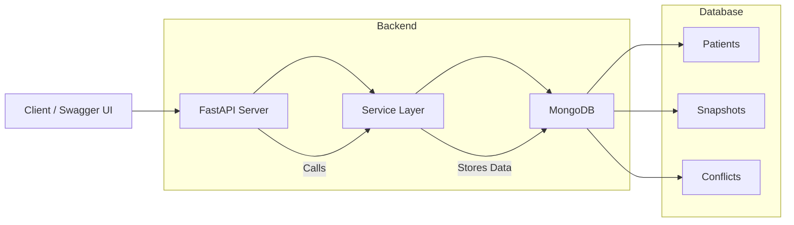
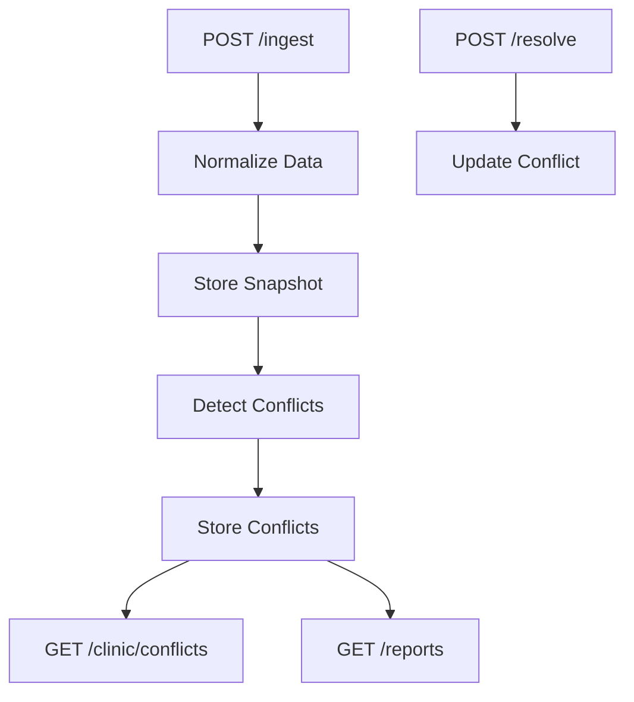
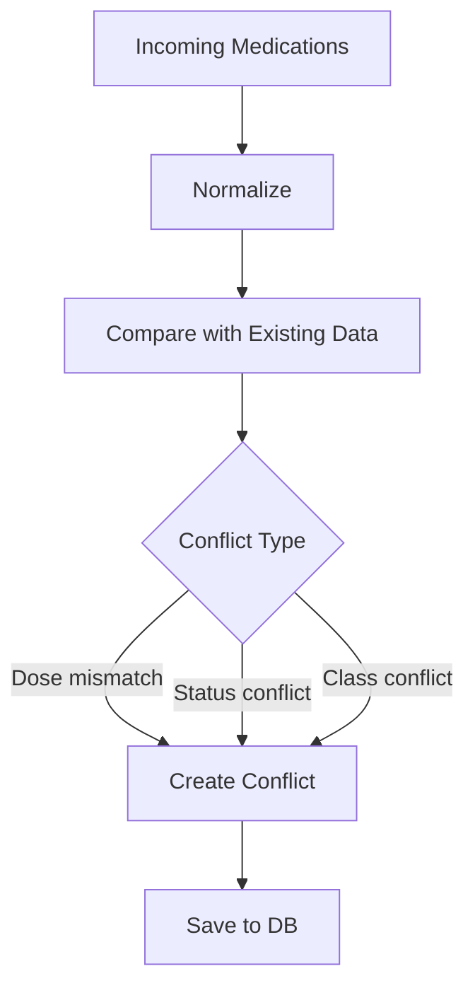

# 🏥 Medication Reconciliation & Conflict Reporting Service

> Backend / Data Engineering · FastAPI + MongoDB  
> Author: Krishnanunni R

---

## 📌 Overview

This project implements a backend service to reconcile medication lists from multiple healthcare sources (clinic EMR, hospital discharge, patient-reported data), detect conflicts, and provide reporting for clinicians.

The system supports:
- Ingestion of medication data from multiple sources
- Versioned storage of medication snapshots
- Conflict detection using rule-based logic
- Aggregation/reporting APIs
- Conflict resolution with audit trail

---

## 🧠 Problem Understanding

Healthcare systems often maintain inconsistent medication lists across multiple sources. This leads to:
- Incorrect dosages
- Conflicting medication status
- Dangerous drug combinations

This system:
✔ Consolidates multiple sources  
✔ Detects inconsistencies  
✔ Enables clinical decision support  

---

## 🏗️ System Architecture

## Data Flow

## Conflict Detection Logic

